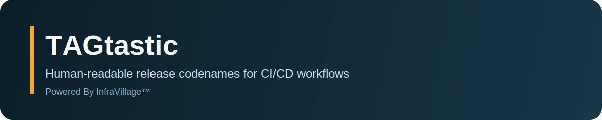

# TAGtastic 🏷️

[](https://github.com/infravillage/tagtastic/actions/workflows/release.yml)
[](https://github.com/infravillage/tagtastic/actions/workflows/ci.yml)
[](https://go.dev/doc/devel/release)
[](https://goreportcard.com/report/github.com/infravillage/tagtastic)
[](LICENSE)

TAGtastic is a deterministic release codename generator designed for CI/CD pipelines and release automation workflows.

Engineered for DevOps teams and release engineers who require:

- **Deterministic codename generation** with reproducible output
- **CI/CD integration** via machine-readable formats (JSON, shell exports)
- **Audit trail** through configuration versioning and changelog integration
- **Zero external dependencies** for air-gapped or restricted environments

TAGtastic follows Semantic Versioning, Keep a Changelog, and integrates with GoReleaser.

## Overview

TAGtastic generates human-readable codenames that complement version tags in release workflows. Each codename is deterministic (based on seed) and can be associated with SemVer tags for improved release communication.

**Use cases:**

- Assign memorable identifiers to releases in CI/CD pipelines
- Generate codenames for internal builds, staging environments, or customer-facing releases
- Maintain consistent naming conventions across distributed teams
- Integrate with GoReleaser, GitHub Actions, GitLab CI, and other automation tools

**Design philosophy:**

- **Single responsibility:** Codename generation only (not release orchestration)
- **Deterministic output:** Same seed produces same codename
- **Configuration as code:** Version-controlled `.tagtastic.yaml` for reproducibility
- **CI-first:** JSON errors, quiet mode, shell exports for automation

## Installation

### Pre-built Binaries

Download the latest release from [GitHub Releases](https://github.com/infravillage/tagtastic/releases):

```bash
# Linux (amd64)
curl -LO https://github.com/infravillage/tagtastic/releases/latest/download/tagtastic_linux_amd64.tar.gz
tar -xzf tagtastic_linux_amd64.tar.gz
sudo mv tagtastic /usr/local/bin/

# macOS (arm64)
curl -LO https://github.com/infravillage/tagtastic/releases/latest/download/tagtastic_darwin_arm64.tar.gz
tar -xzf tagtastic_darwin_arm64.tar.gz
sudo mv tagtastic /usr/local/bin/
```

### Go Install

```bash
go install github.com/infravillage/tagtastic/cmd/tagtastic@latest
```

### Build from Source

```bash
git clone https://github.com/infravillage/tagtastic.git
cd tagtastic/tagtastic-repo
make build
# Binary available at: ./bin/tagtastic
```

### Docker

```bash
docker run --rm ghcr.io/infravillage/tagtastic:latest generate --theme crayola_colors
```

## Quick Start

```bash
# Generate a codename (random seed from timestamp)
tagtastic generate

# Generate with deterministic seed
tagtastic generate --theme crayola_colors --seed 42

# List available themes
tagtastic themes

# Export for shell scripts
tagtastic generate --format shell --quiet
# Output: RELEASE_CODENAME=atomic-tangerine

# JSON output for parsing
tagtastic generate --format json
# Output: {"name":"Atomic Tangerine","theme":"crayola_colors"}
```

## Available Commands

| Command        | Description                         | Example                                              |
| -------------- | ----------------------------------- | ---------------------------------------------------- |
| `generate`     | Generate a codename from a theme    | `tagtastic generate --theme birds --seed 1`          |
| `list`         | List all codenames in a theme       | `tagtastic list --theme crayola_colors`              |
| `themes`       | List available themes               | `tagtastic themes`                                   |
| `validate`     | Validate a codename against a theme | `tagtastic validate "Almond" --theme crayola_colors` |
| `config init`  | Initialize repository configuration | `tagtastic config init`                              |
| `config show`  | Display current configuration       | `tagtastic config show`                              |
| `config reset` | Reset configuration to defaults     | `tagtastic config reset`                             |
| `version`      | Show version information            | `tagtastic version`                                  |

### Command Options

**Global flags:**

- `--quiet, -q`: Suppress non-essential output (ideal for CI)
- `--json-errors`: Emit errors in JSON format for machine parsing
- `--config-path <path>`: Override default config file location

**Generate command:**

- `--theme, -t <theme>`: Theme to use (default: `crayola_colors`)
- `--seed, -s <int>`: Random seed (0 uses current timestamp)
- `--exclude, -e <items>`: Comma-separated items to exclude
- `--format, -f <format>`: Output format (`text`, `json`, `shell`)
- `--record`: Write selected codename to `.tagtastic.yaml`

**Shell format output:**

```bash
RELEASE_CODENAME=blue-heron
```

## Configuration

TAGtastic loads configuration in the following precedence order:

1. `--config-path <path>` command-line flag
2. `TAGTASTIC_CONFIG` environment variable
3. `./.tagtastic.yaml` (repository-local configuration)

### Repository Configuration

Repository configuration (`.tagtastic.yaml`) is optional and recommended for release automation:

```yaml
# .tagtastic.yaml
0.1.0-beta.1: Almond
0.1.0-beta.2: Apricot
0.1.1-beta.1: Aquamarine
```

**Configuration behavior:**

- Never auto-created (explicit opt-in via `generate --record` or release helper)
- Version-controlled for audit trail and reproducibility
- Used by CI/CD workflows to ensure consistent codenames across environments

### Initialize Configuration

```bash
# Preview without writing
tagtastic config init --dry-run

# Create .tagtastic.yaml
tagtastic config init

# Override location
tagtastic config init --config-path /path/to/.tagtastic.yaml
```

## CI/CD Integration

### GitHub Actions

```yaml
name: Release

on:
  push:
    tags:
      - 'v*'

jobs:
  release:
    runs-on: ubuntu-latest
    steps:
      - name: Checkout
        uses: actions/checkout@v4

      - name: Install TAGtastic
        run: |
          curl -LO https://github.com/infravillage/tagtastic/releases/latest/download/tagtastic_linux_amd64.tar.gz
          tar -xzf tagtastic_linux_amd64.tar.gz
          sudo mv tagtastic /usr/local/bin/

      - name: Generate Codename
        id: codename
        run: |
          CODENAME=$(tagtastic generate --theme crayola_colors --format shell --quiet | cut -d= -f2)
          echo "codename=${CODENAME}" >> $GITHUB_OUTPUT

      - name: Create Release
        uses: softprops/action-gh-release@v1
        with:
          name: ${{ github.ref_name }} – ${{ steps.codename.outputs.codename }}
          body: |
            Release ${{ github.ref_name }} (Codename: **${{ steps.codename.outputs.codename }}**)
```

### GitLab CI

```yaml
release:
  stage: deploy
  image: golang:1.25
  script:
    - go install github.com/infravillage/tagtastic/cmd/tagtastic@latest
    - export CODENAME=$(tagtastic generate --format shell --quiet | cut -d= -f2)
    - echo "Release codename: $CODENAME"
    - echo "RELEASE_CODENAME=$CODENAME" >> release.env
  artifacts:
    reports:
      dotenv: release.env
  only:
    - tags
```

### Jenkins Pipeline

```groovy
pipeline {
    agent any
    stages {
        stage('Generate Codename') {
            steps {
                script {
                    sh 'curl -LO https://github.com/infravillage/tagtastic/releases/latest/download/tagtastic_linux_amd64.tar.gz'
                    sh 'tar -xzf tagtastic_linux_amd64.tar.gz'
                    env.RELEASE_CODENAME = sh(
                        script: './tagtastic generate --format shell --quiet | cut -d= -f2',
                        returnStdout: true
                    ).trim()
                    echo "Release codename: ${env.RELEASE_CODENAME}"
                }
            }
        }
    }
}
```

### Docker Build Arguments

```dockerfile
ARG RELEASE_CODENAME=unknown
LABEL codename="${RELEASE_CODENAME}"
LABEL version="${VERSION}"
```

```bash
CODENAME=$(tagtastic generate --quiet)
docker build --build-arg RELEASE_CODENAME="$CODENAME" -t myapp:v1.0.0 .
```

## Release Automation

### Release Integration

TAGtastic integrates with GoReleaser and provides a release helper (`cmd/tools/release`) to automate version management, changelog updates, and git tagging.

**Codename lookup priority (in CI/CD):**

1. Git tag annotation (preferred)
2. `.tagtastic.yaml` entry for the version
3. `CHANGELOG.md` entry for the version

### Release Workflow

#### Option 1: Automated (Recommended for CI/CD)

```bash
# Release helper auto-selects next codename, updates files, creates tag
go run ./cmd/tools/release 0.1.0-beta.2 --commit
git push origin v0.1.0-beta.2
```

#### Option 2: Manual

```bash
# Select next codename
CODENAME=$(make codename -s)

# Update CHANGELOG.md and VERSION manually
vim CHANGELOG.md VERSION

# Create annotated tag with codename
git tag -a v0.1.0-beta.2 -m "v0.1.0-beta.2 – ${CODENAME}"
git push origin v0.1.0-beta.2
```

### Release Helper Tool

The release helper (`cmd/tools/release`) provides:

- **SemVer validation:** Refuses downgrades or version reuse
- **Atomic updates:** `CHANGELOG.md`, `VERSION`, `.tagtastic.yaml` updated together
- **Auto-bump:** `--bump patch|minor|major` for version increments
- **Prerelease support:** `--pre alpha|beta|rc` with optional `--pre-num N`
- **Dry-run mode:** Preview changes without modifying files

**Examples:**

```bash
# Basic release (dry-run by default without --commit)
go run ./cmd/tools/release 0.1.0-beta.2

# Commit changes and create tag
go run ./cmd/tools/release 0.1.0-beta.2 --commit

# Auto-bump patch version
go run ./cmd/tools/release --bump patch --commit

# Create prerelease
go run ./cmd/tools/release 0.2.0 --pre beta --commit

# Custom codename override
go run ./cmd/tools/release 0.1.0-beta.2 --codename "Custom Name" --commit

# CI/CD mode (quiet, JSON errors)
go run ./cmd/tools/release --bump patch --commit --quiet --json-errors
```

**Makefile shortcuts:**

```bash
# Prepare release with specific version
make release-prep VERSION=0.1.0-beta.2

# Auto-bump version
make release-bump BUMP=patch

# Prerelease with auto-bump
make release-bump BUMP=minor PRE=beta
```

### GoReleaser Integration

TAGtastic codenames are injected into GoReleaser via environment variables:

```yaml
# .goreleaser.yaml
release:
  name_template: "v{{ .Version }} – {{ .Env.RELEASE_CODENAME }}"

archives:
  - name_template: "{{ .ProjectName }}_{{ .Version }}-{{ .Env.RELEASE_CODENAME_SLUG }}_{{ .Os }}_{{ .Arch }}"
```

**GitHub Actions workflow:** See [`.github/workflows/release.yml`](.github/workflows/release.yml) for codename extraction logic.

### Release Naming Convention

This project uses **Crayola colors** from the [Corpora repository](https://github.com/dariusk/corpora/blob/master/data/colors/crayola.json) as release codenames.

**Rules:**

- Codenames assigned in **alphabetical order** per release
- Recorded in `CHANGELOG.md`, `.tagtastic.yaml`, and git tag annotations
- SemVer tags remain the source of truth (`v1.0.0-beta.1`)

**Example changelog entry:**

```markdown
## [0.1.0-beta.1] – "Almond" – 2026-01-03
```

**Data sources:**

- `data/crayola.json`: Raw Corpora snapshot
- `data/themes.yaml`: Structured theme data
- `internal/data/themes.yaml`: Embedded copy (sync with `make sync-themes`)

**Next codename:**
```bash
make codename
# or
go run ./cmd/tools/next-codename
```

## Themes

TAGtastic includes multiple codename themes:

- `crayola_colors` — Crayola crayon colors (default)
- `birds` — Bird species
- `cities` — World cities
- `landmarks` — Famous landmarks
- And more (run `tagtastic themes` to see all)

### Custom Themes

Edit `data/themes.yaml` to add custom themes:

```yaml
themes:
  your_theme:
    id: your_theme
    name: "Your Theme Name"
    description: "Theme description"
    category: "Category"
    items:
      - name: "Item One"
        aliases: ["item-one"]
        description: "Description"
```

After editing, sync the embedded copy:

```bash
make sync-themes
# or
go run ./cmd/tools/sync-themes
```

## Development

### Repository Structure

```text
tagtastic-repo/
├── cmd/
│   ├── tagtastic/          # CLI entrypoint
│   └── tools/              # Release helper, codename generator, theme sync
├── internal/
│   ├── cli/                # Command implementations
│   ├── config/             # Configuration handling
│   ├── data/               # Theme repository and types
│   └── output/             # Output formatters (text, JSON, shell)
├── data/
│   ├── themes.yaml         # Theme definitions (source)
│   └── crayola.json        # Crayola colors raw data
├── .github/workflows/      # CI/CD automation
├── .goreleaser.yaml        # GoReleaser configuration
├── Makefile                # Build and development tasks
└── CHANGELOG.md            # Release history
```

### Build and Test

```bash
# Build local binary
make build

# Run tests with race detection and coverage
make test

# Run linter
make lint

# Format code
make fmt

# Run all quality checks
make quality

# Build release artifacts (GoReleaser)
make release
```

### Code Quality

**Local validation:**
```bash
# Run golangci-lint, gofmt, go vet
make quality

# Go Report Card (local)
go install github.com/gojp/goreportcard/cmd/goreportcard-cli@latest
goreportcard-cli
```

**CI/CD:** See [Go Report Card badge](https://goreportcard.com/report/github.com/infravillage/tagtastic) for hosted analysis.

### Testing

```bash
# Run all tests
go test ./...

# Run specific test
go test -v ./internal/cli -run TestGenerateCmd

# Run tests with race detection
go test -race ./...

# Generate coverage report
go test -coverprofile=coverage.out ./...
go tool cover -html=coverage.out
```

## Contributing

Contributions are welcome. Please review [CONTRIBUTING.md](CONTRIBUTING.md) for:

- Development standards and coding style
- Testing requirements (≥80% coverage)
- Commit message conventions (Conventional Commits)
- Pull request guidelines

**Quick guidelines:**

- Use `gofmt -s` and `goimports` for formatting
- Run `make test` and `make lint` before submitting PRs
- Follow [Keep a Changelog](https://keepachangelog.com/) for `CHANGELOG.md` updates
- Use Conventional Commits: `feat(cli):`, `fix(data):`, `docs:`

## Project Status

- **Current focus:** Stabilizing v1 specification
- **Release phases:** alpha → beta → stable
- **Versioning:** Semantic Versioning 2.0.0
- **Changelog:** Keep a Changelog 1.0.0

Scope expansion is intentional and conservative. Feature requests and architectural changes are evaluated against the core mission: deterministic codename generation for release automation.

## Security

### Reporting Security Issues

**Do not report security vulnerabilities through public GitHub issues.**

If you discover a security vulnerability in TAGtastic, please report it privately:

1. **Email:** Send details to `security@infravillage.com` (or create a private security advisory via GitHub)
2. **Include:** Detailed description, steps to reproduce, potential impact, and suggested fix (if available)
3. **Response time:** We aim to acknowledge reports within 48 hours

### Security Considerations

TAGtastic is designed for use in CI/CD pipelines. Consider these security practices:

- **Configuration files:** Never commit sensitive data to `.tagtastic.yaml` (it only stores codenames)
- **Supply chain:** Verify release checksums and use pinned versions in production
- **Air-gapped environments:** TAGtastic has zero external dependencies and can run offline
- **Least privilege:** Run with minimal permissions required for file I/O
- **Input validation:** All theme data is embedded at build time; no remote data fetching
- **Security scanning:** This project is scanned with [gosec](https://github.com/securego/gosec) on every PR and commit

### Supported Versions

| Version | Supported          |
| ------- | ------------------ |
| 0.1.x   | :white_check_mark: |
| < 0.1   | :x:                |

Security patches are applied to the latest minor version. Once v1.0.0 is released, we will maintain the latest stable major version.

## License

MIT License. See [LICENSE](LICENSE) for details.

## Credits

- **CLI Framework:** [Kong](https://github.com/alecthomas/kong) by Alec Thomas
- **Release Automation:** [GoReleaser](https://goreleaser.com/)
- **Codename Data:** [Corpora](https://github.com/dariusk/corpora) by Darius Kazemi
